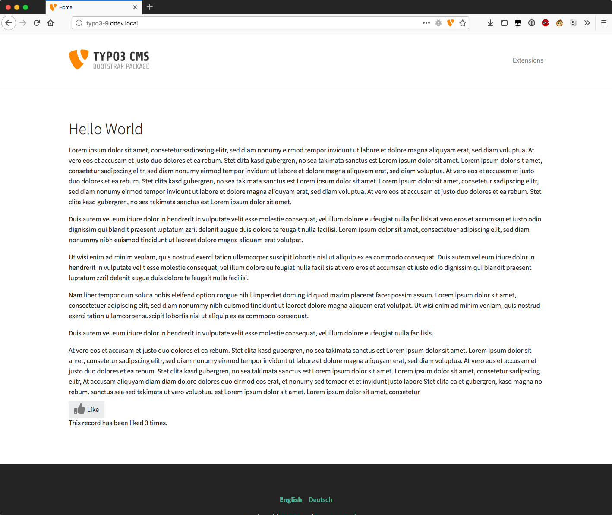
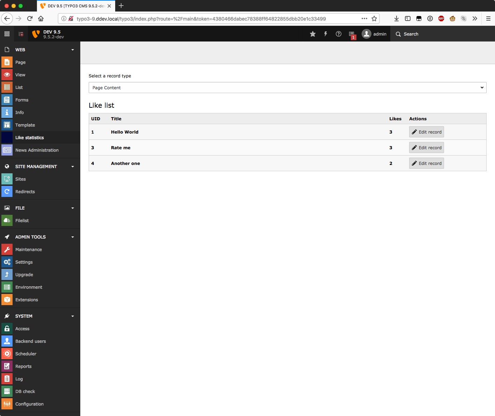

.. ==================================================
.. FOR YOUR INFORMATION
.. --------------------------------------------------
.. -*- coding: utf-8 -*- with BOM.

.. include:: ../Includes.txt

.. _introduction:

Introduction
============

.. _what-it-does:

What it does?
-------------

This extension allows you to integrate a like button functionality for nearly any frontend plugin (Text, events, news, ...).

Screenshots
-----------

